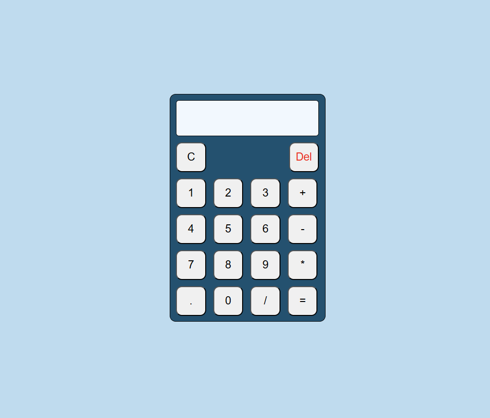

# 🧮 Simple Calculator Web Application

A responsive calculator built using **HTML, CSS, and JavaScript**.  
It supports **basic arithmetic operations**, **keyboard input**, and has a clean, styled interface with real-time expression evaluation.

---

## 🚀 Features
- ✅ Perform addition, subtraction, multiplication, and division  
- ✅ Support for both **mouse clicks** and **keyboard inputs**  
- ✅ Clear (C) and Delete (Del) functionality  
- ✅ Decimal number support  
- ✅ Expression evaluation with **operator precedence**  
- ✅ Responsive layout using CSS Grid & Flexbox  
- ✅ Error-free and smooth user experience 

